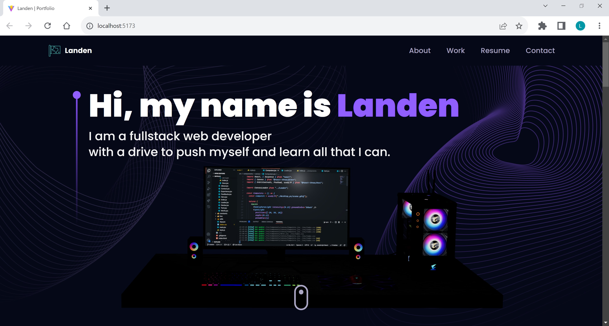

# Landen Portfolio Website

## Title

Landen Portfolio Website

# Table of Contents

- [GitHub](#github)
- [Description](#description)
- [Installation](#installation)
- [Usage](#usage)
- [License](#license)
- [How To Contribute](#howtocontribute)
- [Tests](#tests)
- [Screenshot](#screenshot)
- [Link](#link)

## GitHub

[Link](https://www.github.com/lwalker107)

## Email

landenwalker880@gmail.com

## Description

Functioning portfolio website used to show employers who I am, display my projects, a way to contact me and a
downloadable resume.

## Installlation 

What needs to be installed for this application: 
- [@emailjs/browser]
- [@react-three/drei]
- [@react-three/fiber]
- [framer-motion]
- [maath]
- [react-tilt]
- [react-router-dom]
- [tailwindcss]
- [react-vertical-timeline-component] 
- [postcss]

## Usage

Used as a way to show who I am as a developer and to maintain a way to contact me and a way to maintain
my portfolio

## License

MIT

## How to Contribute

Would prefer if nobody else contributed to my portfolio website, but me.

## Tests

None

## Screenshot

## Link 

https://drive.google.com/file/d/1DFFF-e193le8YKHQyb4IoAbfwPFZJ5T1/view